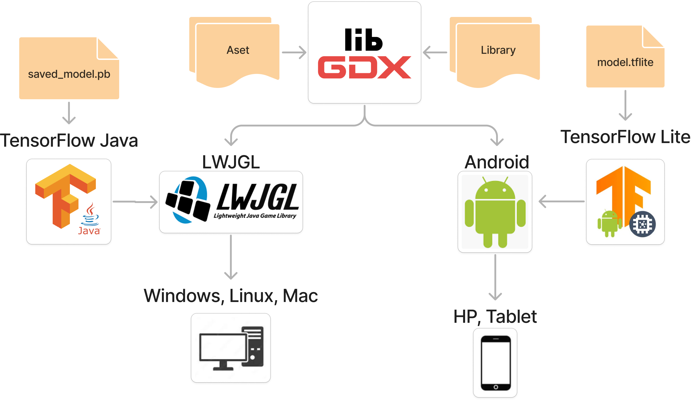
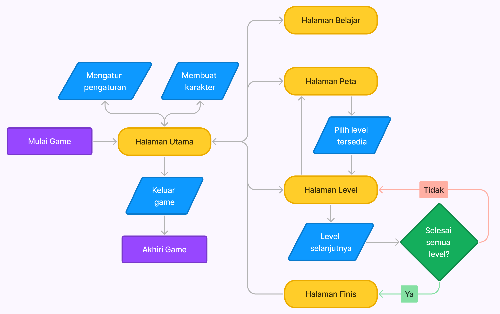
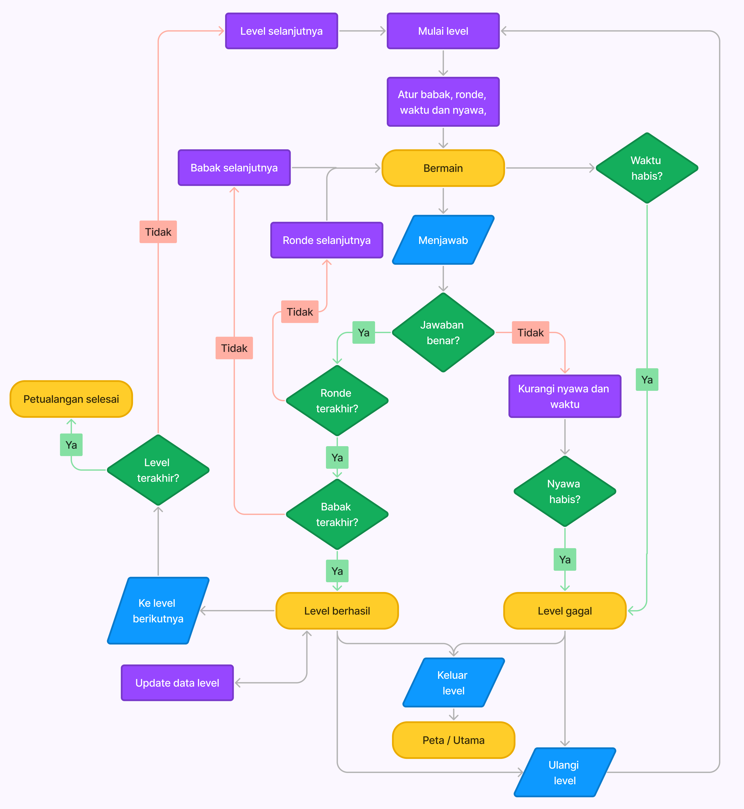

# 🏁 Tugas Akhir (TA) - Final Project

**Nama Mahasiswa**: Doanda Dresta Rahma  
**NRP**: 5025201049  
**Judul TA**: Pengembangan Game Mobile Android sebagai Edukasi Huruf Hijaiyah Menggunakan LibGDX dengan Bahasa Kotlin  
**Dosen Pembimbing**: Siska Arifiani, S.Kom., M.Kom.   
**Dosen Ko-pembimbing**: Imam Kuswardayan, S.Kom., MT.

---

## 📱 Petualangan Hijaiyah | Game Edukasi Interaktif

Game edukasi yang dirancang untuk membantu belajar huruf hijaiyah dengan cara yang menyenangkan dan interaktif. Game ini memiliki beberapa fitur utama, seperti berbagai jenis minigame yaitu seret dan lepas, menarik garis, atau menulis huruf, antarmuka intuitif yang dipandu tutorial, serta integrasi model machine learning untuk pengenalan tulisan huruf hijaiyah. Arsitektur aplikasi menggunakan framework LibGDX dengan bahasa pemrograman Kotlin, memanfaatkan TensorFlow untuk mendukung fungsi pengenalan tulisan tangan pada platform Android dan Desktop.

---

## 📺 Demo Aplikasi  

[](https://www.youtube.com/watch?v=SkscpHuWhwk)  
*Klik gambar di atas untuk menonton demo*

---

## 🛠 Panduan Instalasi & Menjalankan Software

### 💻 Menjalankan di Android Studio

#### Prasyarat  
- **Android Studio** (disarankan versi terbaru)  
- **JDK 11 atau 17**  
- **Gradle** (otomatis disertakan dalam Android Studio)

#### Langkah-langkah  
1. **Clone Repository**  
   ```bash
   git clone https://github.com/Informatics-ITS/ta-doandadr.git
   ```

2. **Buka Proyek di Android Studio**  
   - Buka Android Studio → `Open > [folder-proyek]`  
   - Tunggu proses sinkronisasi Gradle selesai

3. (Android) **Setup Emulator**  
   - Buka **Device Manager** di Android Studio
   - Klik `Create device` → pilih perangkat (misalnya: Pixel 4)  
   - Pilih sistem operasi Android (minimal Android 8) dan klik `Finish`

4. (Android) **Jalankan Aplikasi Android**  
   - Pilih konfigurasi `android` pada dropdown Run Configuration (kanan atas)  
   - Klik tombol ▶️ **Run** atau tekan **Shift + F10**  
   - Aplikasi akan otomatis dibangun dan dijalankan di emulator atau perangkat

5. (Desktop) **Jalankan Aplikasi Desktop**  
   - Navigasikan ke file: `lwjgl3\src\main\kotlin\com\github\doandadr\petualanganhijaiyah\lwjgl3\Lwjgl3Launcher.kt` 
   - Klik kanan pada file tersebut → pilih **Run 'Lwjgl3Launcher'**

### 📦 Menjalankan dari File APK (Tanpa Android Studio)

1. **Unduh APK**  
   - Kunjungi tab [**Releases**](https://github.com/Informatics-ITS/ta-doandadr/releases)  
   - Unduh file `.apk` terbaru, misalnya: `PetualanganHijaiyah-v1.0.1beta-release.apk`

2. **Pindahkan ke HP Android**  
   - Gunakan kabel USB, Google Drive, atau metode lain

3. **Izinkan Instalasi dari Sumber Tidak Dikenal**  
   - Buka **Pengaturan > Keamanan**  
   - Aktifkan opsi **"Instalasi dari sumber tidak dikenal"**

4. **Instal & Jalankan**  
   - Buka file APK dan instal  
   - Setelah selesai, buka aplikasi dari layar utama

---

## 📚 Dokumentasi Proyek

- ### Arsitektur
  
- ### Alur Flowchart Game
  
- ### Alur Flowchart Level
  

---

## 🧪 Metodologi
Proyek ini dikembangkan menggunakan **Game Development Life Cycle (GDLC)** dengan tahapan sebagai berikut:

1. **Initiation** – Menentukan tujuan edukatif game dan mengidentifikasi kebutuhan serta karakteristik pengguna.
2. **Pre-Production** – Merancang konsep permainan, alur interaksi, dan desain antarmuka berdasarkan referensi yang ada.
3. **Production** – Mengimplementasikan logika game, desain UI, serta mengintegrasikan model klasifikasi huruf hijaiyah ke dalam aplikasi.
4. **Testing** – Melakukan pengujian fitur, kestabilan aplikasi, serta validasi akurasi model pengenalan karakter.
5. **Beta** – Mendistribusikan versi uji coba kepada pengguna terbatas untuk mendapatkan masukan dan mengidentifikasi bug.
6. **Release** – Melakukan perbaikan akhir berdasarkan umpan balik beta dan merilis versi final yang stabil disertai dokumentasi lengkap.

---

## ⁉️ Pertanyaan?

Hubungi:
- Penulis: doanda.dev[at]gmail.com
- Pembimbing Utama: siska[at]its.ac.id
